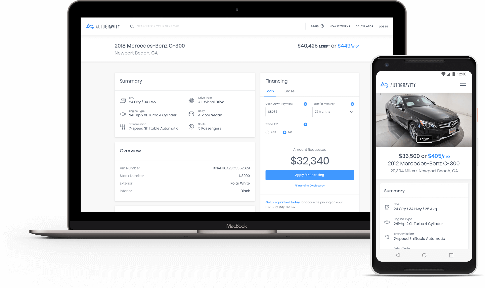
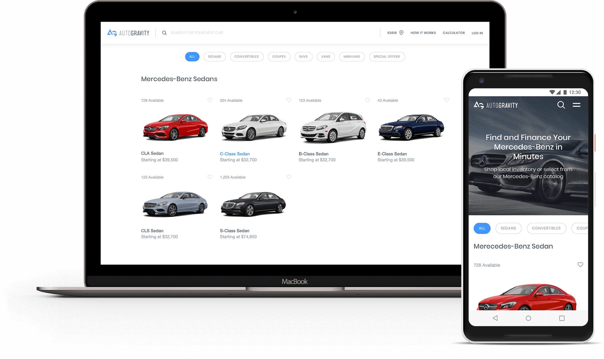
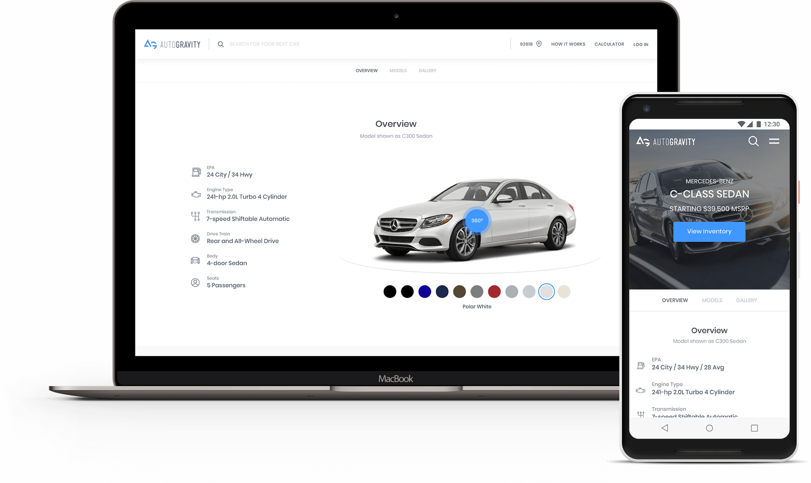
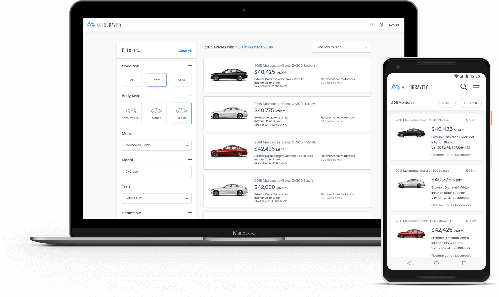
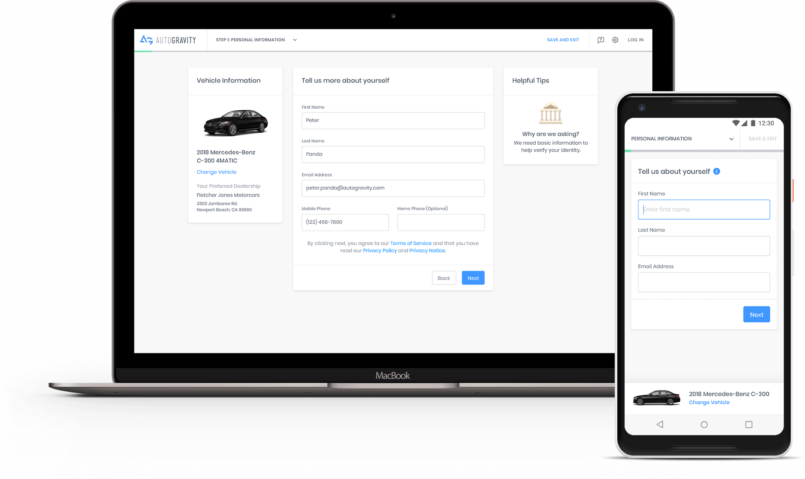

### What was the ask of the project?

AutoGravity worked with a consulting agency to design a prototype for a Proof of Concept. When I came on board, they were looking to improve designs for the initial launch. In addition to improving designs for current functionality, they also wanted to add functionality such as leasing, account management, and improving the credit application flow.

### It all starts with the shopping experience
The ability to easily find the right model is key for this experience. Users want to shop by brand or vehicle type and then get an overview of the model they are looking for. The small details about the vehicle are what helps the user make the final decision in many cases. Having that available for new cars made a huge difference in the overall flow.

### Filtering inventory was a feature that our users requested from us in app store reviews
We knew we needed the ability to filter inventory, but when it should be prioritized was the question. Users made it very clear what was important to them in our iOS reviews and that translated to our responsive web experience as well.

### Optimizing the credit application through A/B testing
We wanted to increase the percentage of users that completed our credit application and we did this through A/B testing using optimizely. We tested two different options, a long form, and a guided step by step option. The Step by step option had a statistically significant advantage over the long form. 

