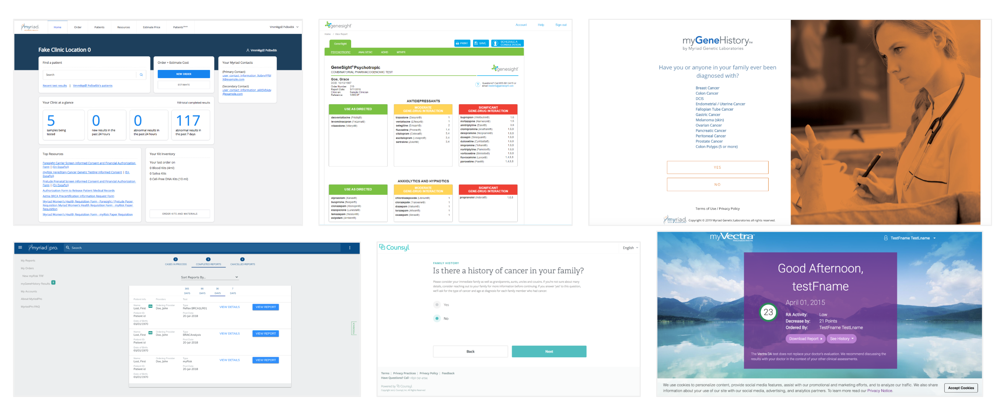
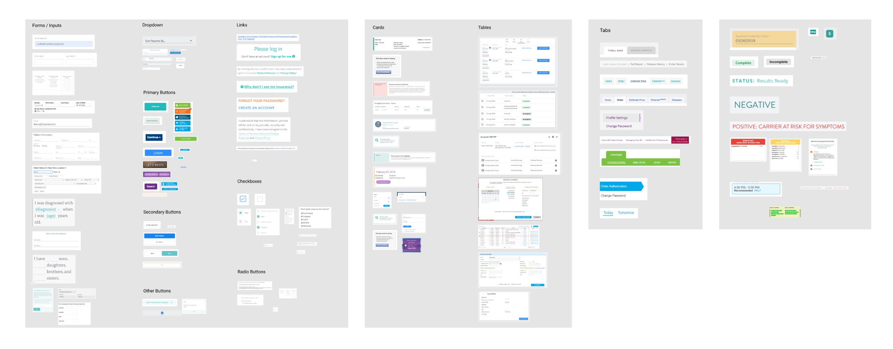
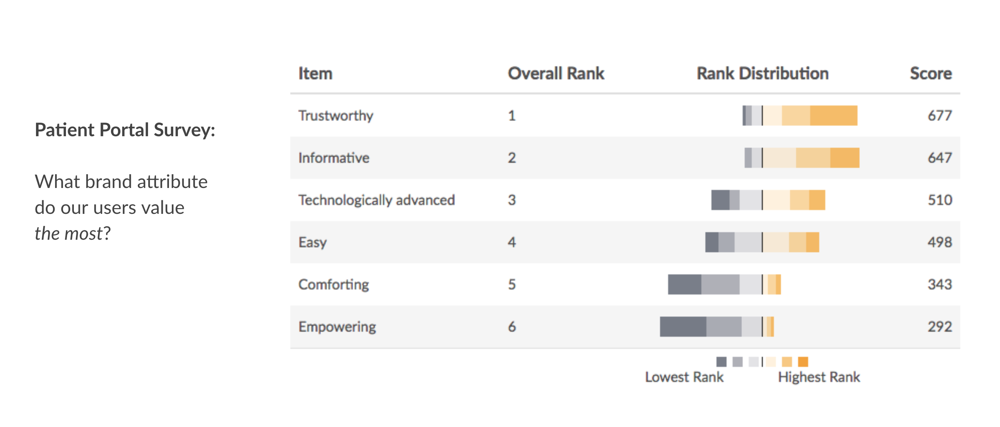

### The problem 
Our parent company recently acquired us and another company to add to their portfolio of business units. We wanted to design a system that would allow for consistency, speed and a fesh, modern look. Moreover, we wanted to take the burden off of our engineers to translate designs for each project and instead create reusable React components.

### Current state of portals for each Business Unit
We started out by doing an inventory of all of our portals (Provider and Patient facing)across the parent company just to illustrate how different each of our portals looks. If we were going to have a cohesive feel, we needed to have consistency across the board.

### Design Principles
We also took into consideration some survey work that had been done previously to determine what was important to our users. This was importan for us to use to determine the look and feel of everything we designed.

[It's all blue](./panels.png)
[It's all blue](./primary-buttons.png)
[It's all blue](./depth.png)

