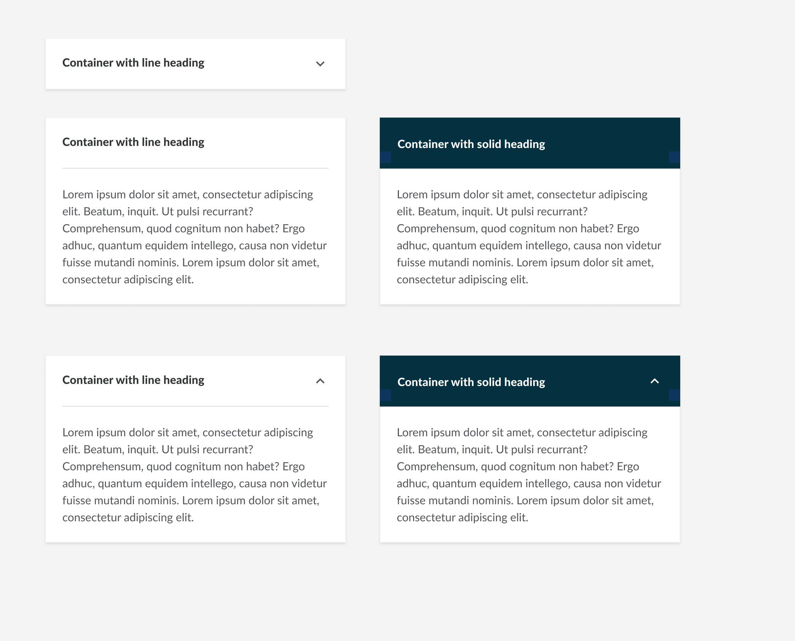
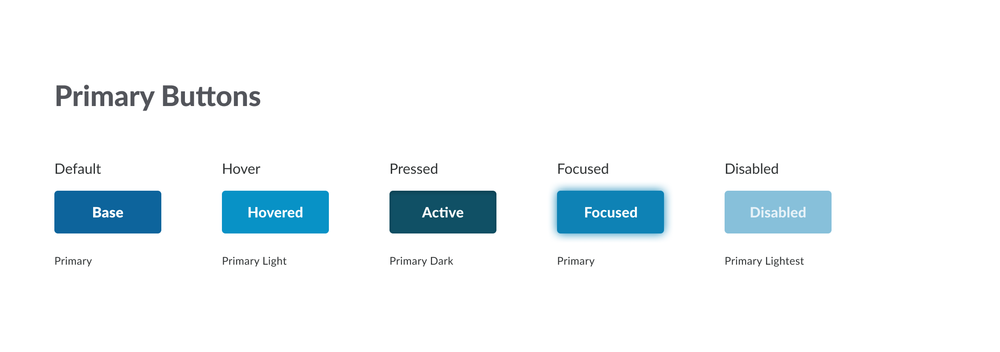
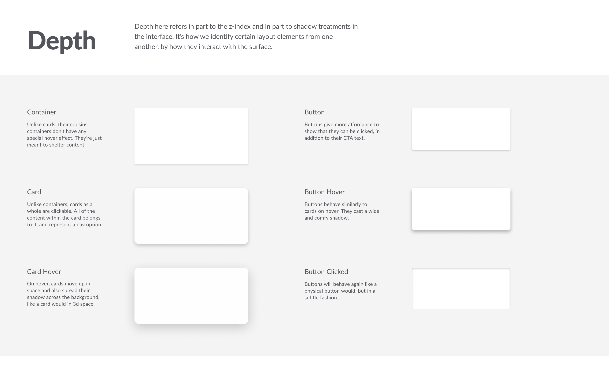
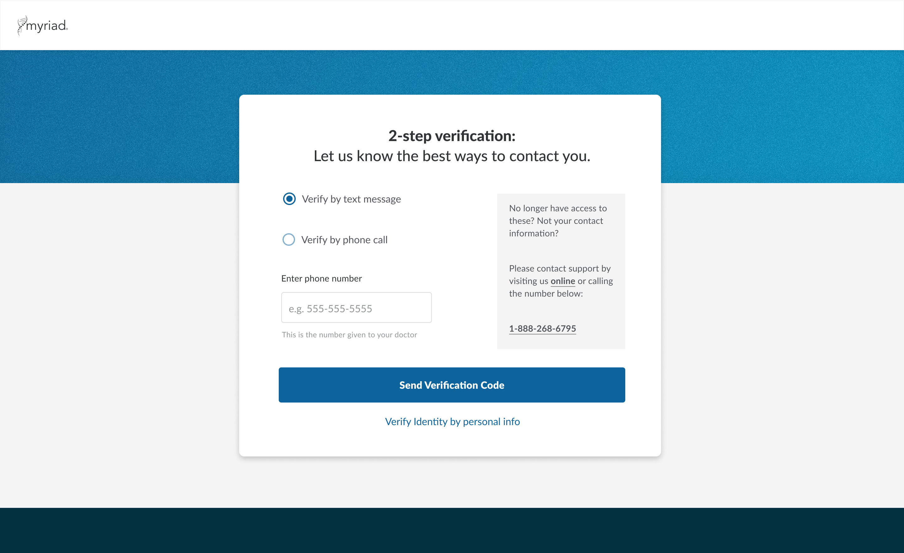
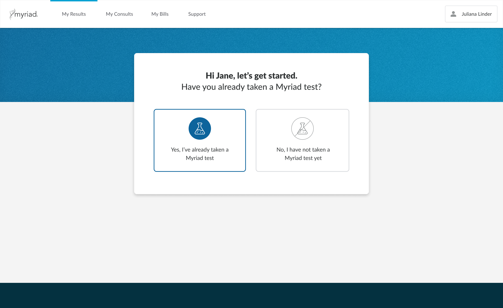
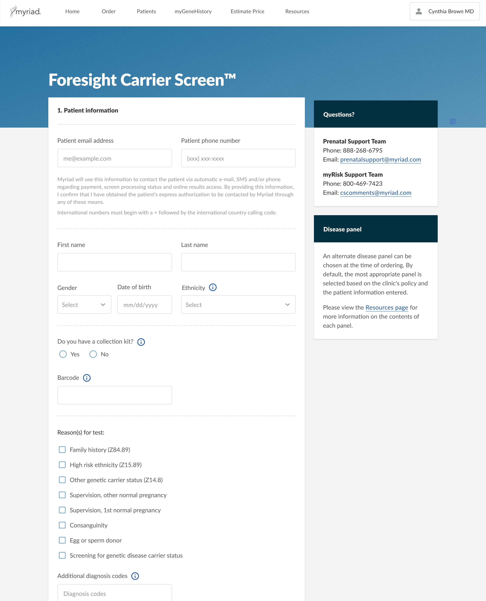
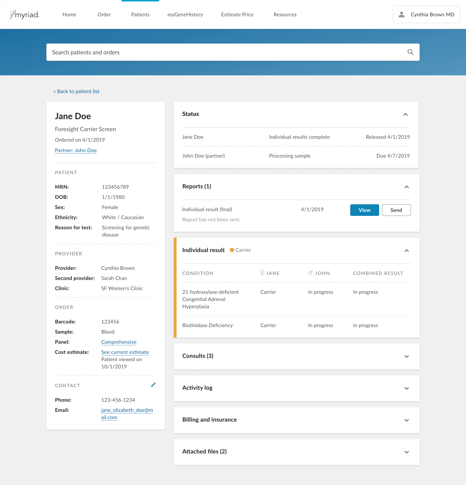

### The problem 
Our parent company recently acquired us and another company to add to their portfolio of business units. We wanted to design a system that would allow for consistency, speed and a fesh, modern look. Moreover, we wanted to take the burden off of our engineers to translate designs for each project and instead create reusable React components.

### Current state of portals for each Business Unit
We started out by doing an inventory of all of our portals (Provider and Patient facing)across the parent company just to illustrate how different each of our portals looks. If we were going to have a cohesive feel, we needed to have consistency across the board.

### Design Principles
We also took into consideration some survey work that had been done previously to determine what was important to our users. This was importan for us to use to determine the look and feel of everything we designed.

### Creating Modular elements and components
We wanted to have a look and feel that was mostly neutral to allow for use across different business units and that allowed for individal theming. We used our parent brand blues mostly for main components while allowing for accent colors for different products.

### Using the design system for different products
We used the new system for the redesign of both our provider and patient portals. Almost instantly, you could start to see the how cohesive the look and feel became. No longer did they look like two different companies. We now had brand consistency, at least within the Women's Health Business Unit.

### Next Steps
We are still in the process of working on illustrations and motions for the design system. We have a solid baseline for the illustrations and iconography direction so far.

