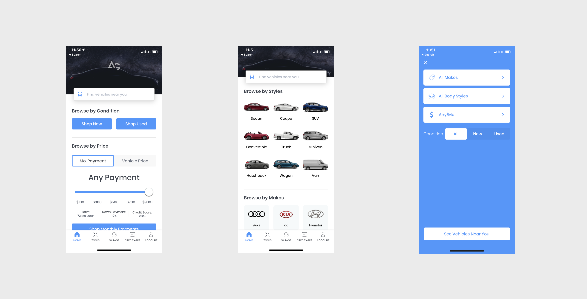
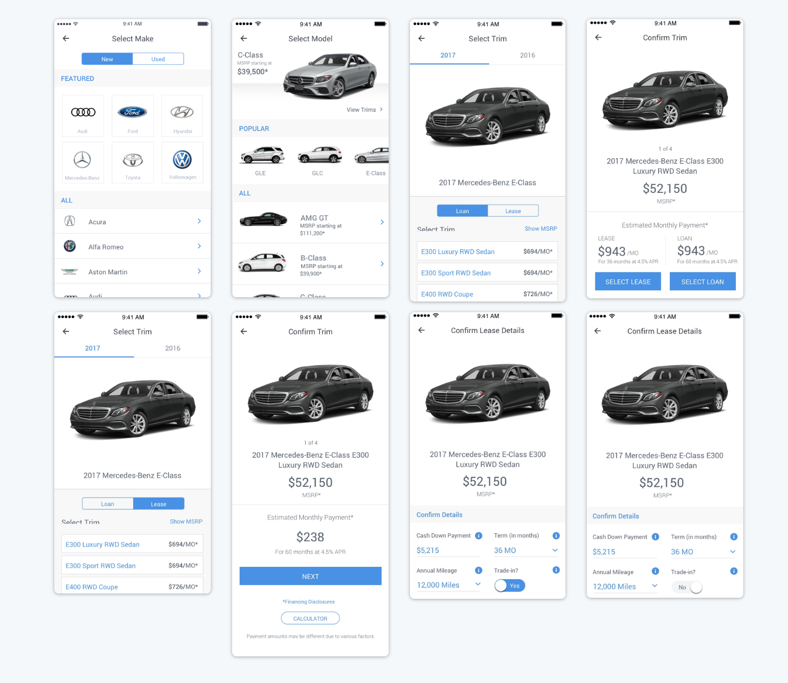
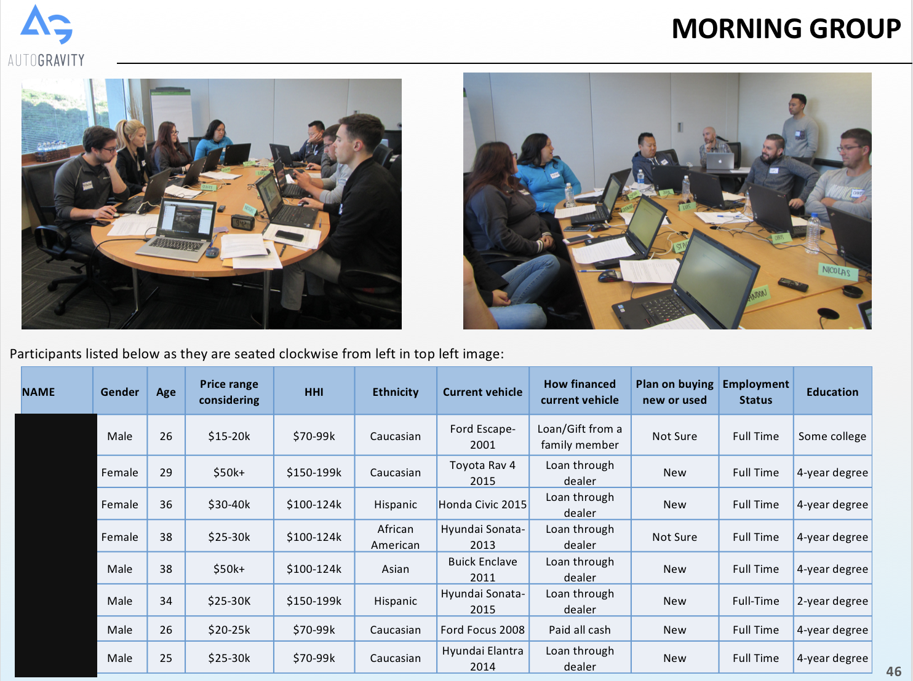
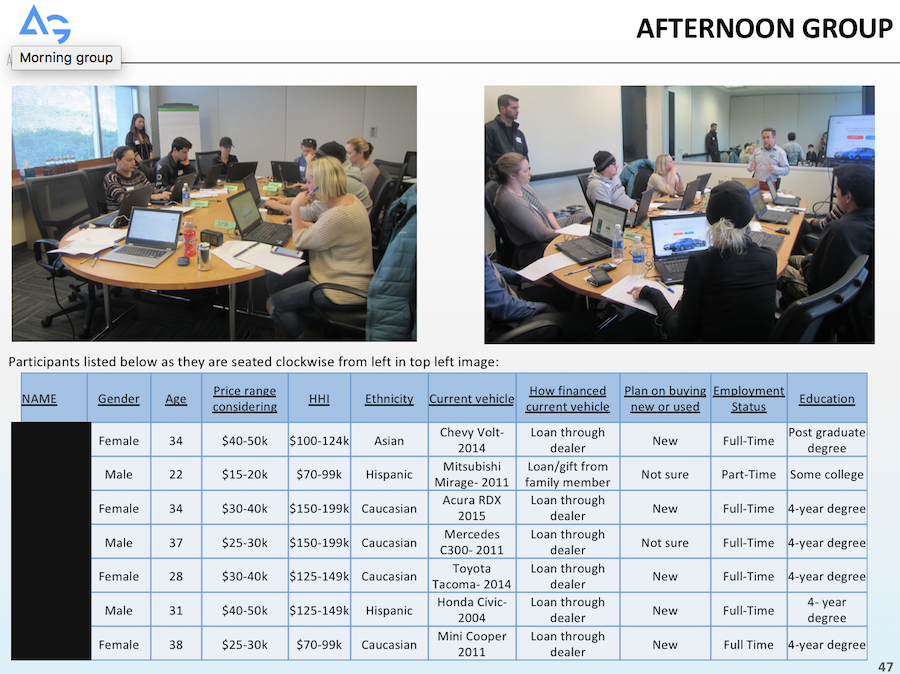
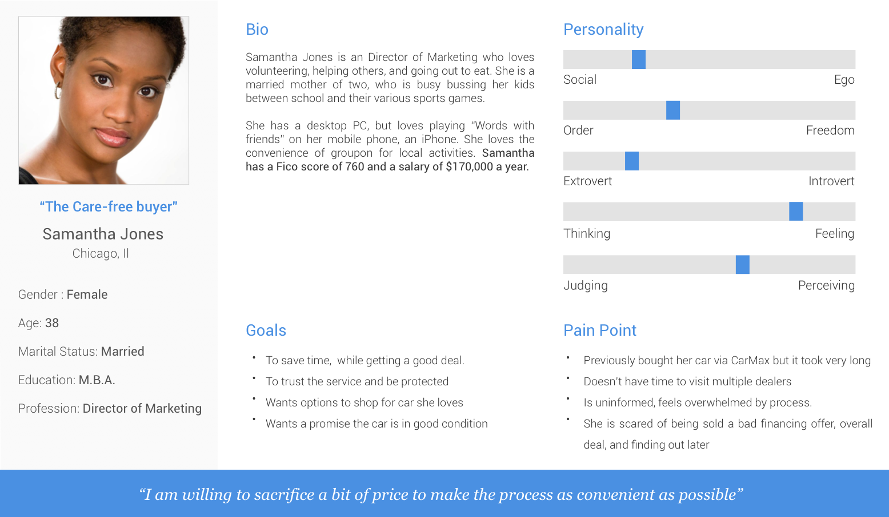
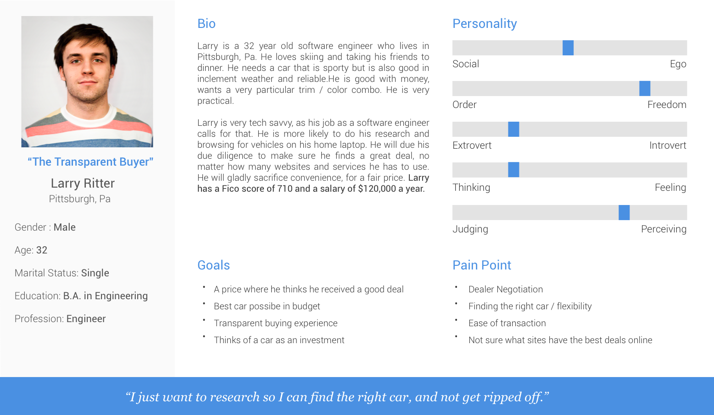
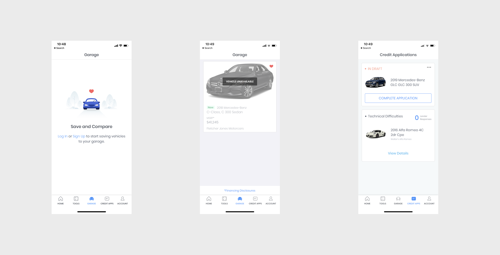

### Original Design of shopping experience
While the initial launch of our app was successful, we knew we needed to do a better job giving users the options they really wanted in order to find their dream car. At the time, they could only shop by brands.

### User Research
We conduected a focus group to chat with potential users about what they wanted in a car buying experience. AutoGravity didn't score very well during this activity due to its lack of shopping options.

### Creating Personas
Once we gathered our informtation from the focus group; we used that along with other customer research to create peronas. These personas alowwed us to understand our current users, and we SHOULD be targeting when we build features.

## Translating this data into designs
We used the insights that we learned to put together a much more robust shopping experience. We used the data that tols us users wanted to shop by 'New and Used', Pricing, vehicle type, and to browse by payment price to give themm all of these tools on the home page. 

## Adding Tab Bar, Saving Cars and Credit Apps
We also heard that users wanteds to be able to compare vehicles and save for shopping later. Based on this, we added a tab bar that allowed users to get back and forth to what was most important to them. Whether it was finding out a car they liked was just sold, or finishing a credit application. THis ended up being one of our most popular features overall.

