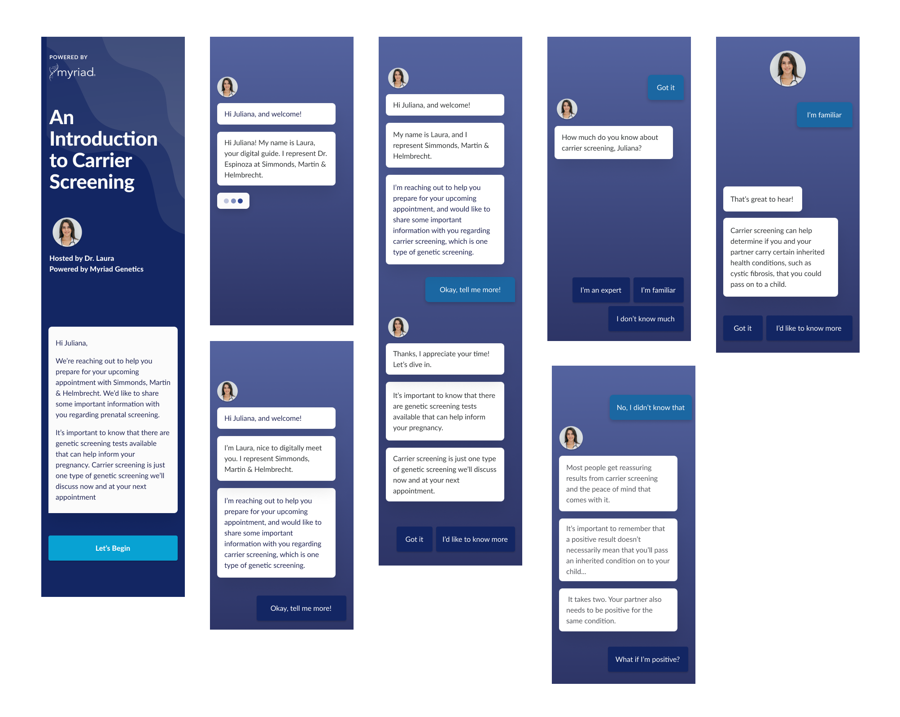
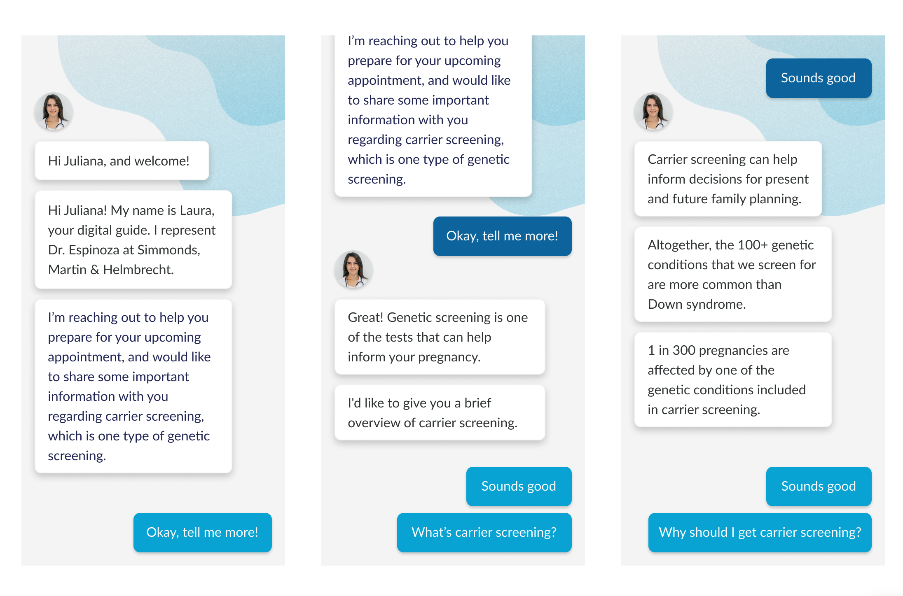
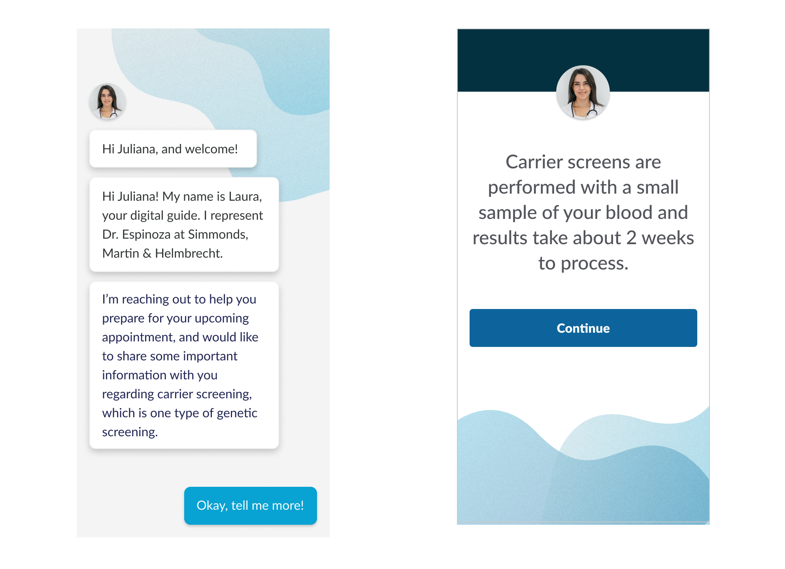

### Color and Brand Exploration
With our company creating a new business unit and with a newly created style guide, we wanted to take this opportunity to explore different color options. In the end, the lighter more "feminine" colors resonated more with our users during the research process.

### User Testing Concepts (Chatbot vs Guided)
During our concepting, we narrowed our options down to two. We did a few rounds of user testing, and ultimately users overwhelmingly preferred the "Guided" as experience. Users stated that they thought the chatbot seemed forced and inauthentic. Users also stated that they thought the small, "digestible", pieces of content in the guided flow felt very natural.

### Figma Prototype
Expand the prototype and click through to see the entire flow. This is a screen by screen prototype of the patient experience. This prototype was used to get feedback from stakeholders during the process.

<iframe style="border: none;" width="800" height="450" src="https://www.figma.com/embed?embed_host=share&url=https%3A%2F%2Fwww.figma.com%2Fproto%2FdZI1SrkeYVc0NjX447CYDQJx%2FDorsata-Exploration%3Fnode-id%3D438%253A230%26scaling%3Dscale-down" allowfullscreen></iframe>

