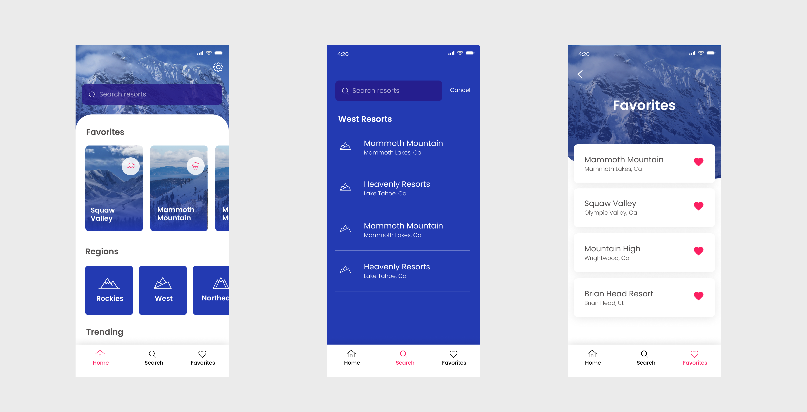
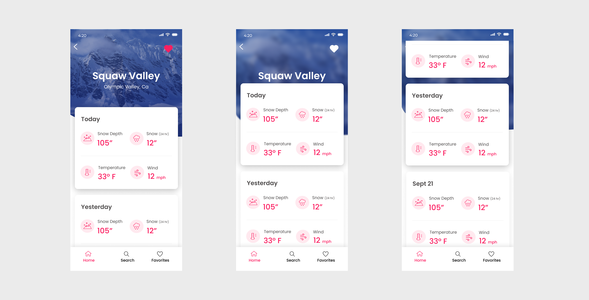

### A fun side project to design something for one of my favorite activities. Snowboarding!

There are a couple of apps the I have used to get snow reports, but none of them were very modern looking or well designed in general. I tasked myself with coming up with a design based on an API I found online. I knew exactly what Data we would be able to grab and I based the functionality on that.

### Scrollable content cards

There are a couple of apps the I have used to get snow reports, but none of them were very modern looking or well designed in general. I tasked myself with coming up with a design based on an API I found online. I knew exactly what Data we would be able to grab and I based the functionality on that.

### Figma Prototype

Here is a quick prototype I created to handoff to the iOS engineer I am working with. It helps with our development process to show some of the interactions and the overall flow.

<iframe style="border: none;" width="800" height="450" src="https://www.figma.com/embed?embed_host=share&url=https%3A%2F%2Fwww.figma.com%2Fproto%2FOYY45zTQm4uuMj8tzZBErA%2FD3PTH%3Fnode-id%3D241%253A551%26scaling%3Dscale-down" allowfullscreen></iframe>

