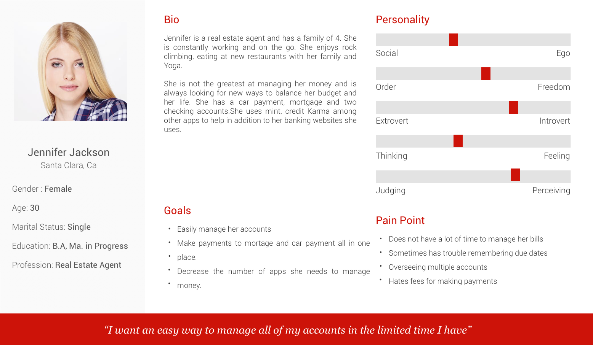
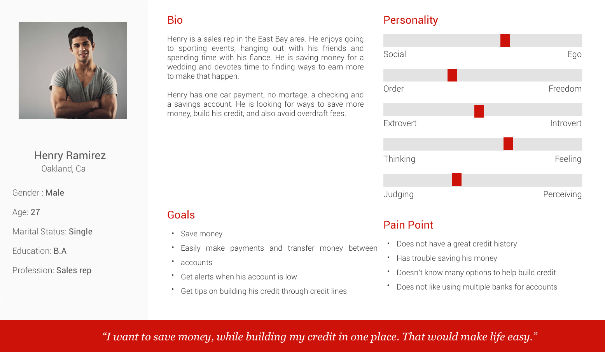
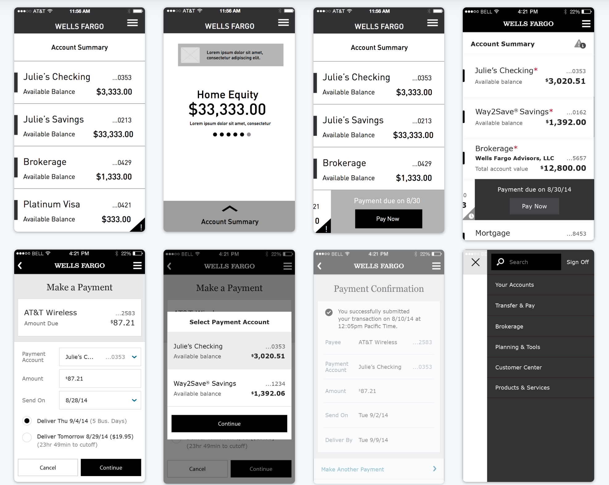
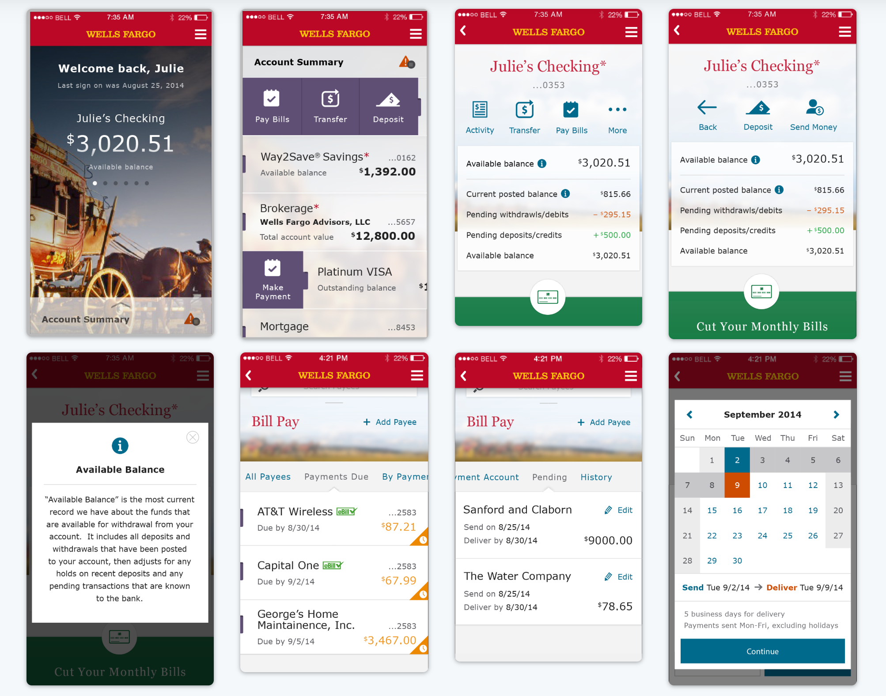

Wells Fargo wanted a redesign of their mobile application that improved the user experience while also making the ui more modern. The main emphasis on the project was making it easier for the user to complete common tasks.

### Creating personas
Wells fargo allowed us to interview customers in order to come up with personas and user insights. Based on this research, we were able to identify the users we wanted to target for the redesigned mobile app. Between these users, the common theme was the ability to easily oversee multiple account from one place. Users wanted to make payments and transfer money between accounts within a few clicks.

### Wireframes

Based on the user research, we designed wireframes that would solve pain points of the personas targeted. Quick entry points and gestures were how we decided to handle simplifying activity between accounts.

### Visual Designs
After a round of user testing and edits, we created the final UI based on Wells Fargo's brand guidelines.

### Final thoughts
This design and UI has recieved extremely positive feedback since its release. It was a very fun project to work on in a short timeline.

